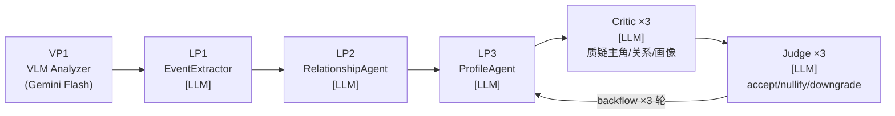
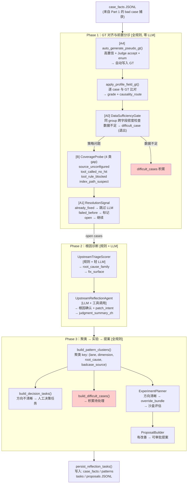
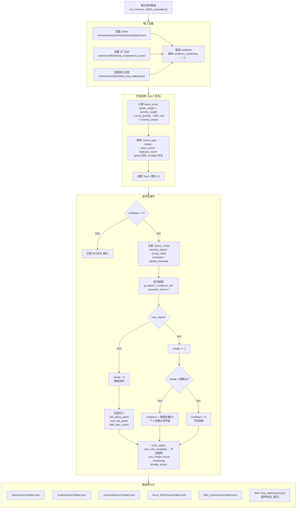
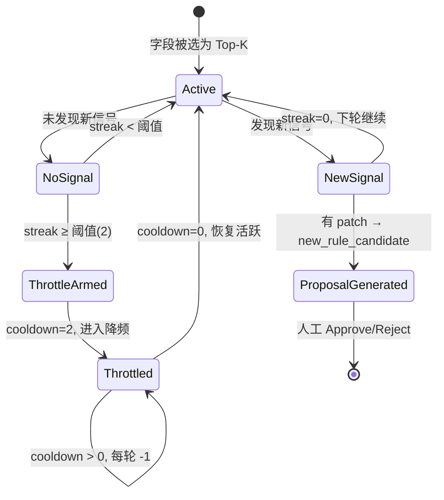

# 架构链路图（Mermaid）

> 更新时间：2026-03-28

---

## 链路图 1：画像与关系生成 + 下游审计

```mermaid
flowchart TD
    INPUT["用户上传照片<br/>photos + face_db + vlm_results"]

    subgraph MAINLINE["主链路生成 (orchestrator.py)"]
        direction TB
        M1["① screen_people()<br/>人物过滤 [规则]"]
        M2["② analyze_primary_person()<br/>主角识别 [LLM]"]
        M3["③ extract_events()<br/>LP1 事件提取 [LLM]"]
        M4["④ build_relationship_dossiers()<br/>LP2 证据卷宗 [规则]"]
        M5["⑤ infer_relationships()<br/>LP2 关系推断 [LLM]"]
        M6["⑥ detect_groups()<br/>社群检测 [规则]"]
        M7["⑦ build_profile_context()<br/>画像上下文 [规则]"]
        M8["⑧ generate_structured_profile()<br/>LP3 画像生成 [LLM·ProfileAgent]"]
        M1 --> M2 --> M3 --> M4 --> M5 --> M6 --> M7 --> M8
    end

    subgraph AUDIT["下游审计 (downstream_audit.py)"]
        direction TB
        A1["⑨ MainOutputExtractor.build_v1_outputs()<br/>构建 V1 输出 [规则]"]

        subgraph JUDGE_LOOP["对每个 agent_type (主角/关系/画像)"]
            direction TB
            C1["Critic.run(v1)<br/>质疑 [LLM]"]
            V2["build_v2_output()<br/>回源补证 [规则]"]
            J1["Judge.run(v2, critic)<br/>裁决 [LLM]<br/>accept / nullify / downgrade"]
            MG["_merge_judge_decisions()<br/>合并裁决 [规则]"]
            C1 --> V2 --> J1 --> MG
        end

        A1 --> JUDGE_LOOP
    end

    subgraph BACKFLOW["回流循环 (main.py, 最多 3 轮)"]
        direction TB
        B1["第1轮: protagonist_backflow<br/>nullify → photographer_mode<br/>→ rerun groups + LP3"]
        B2["第2轮: relationship_backflow<br/>nullify → 删除关系<br/>→ rerun groups + LP3"]
        B3["第3轮: profile_backflow<br/>nullify → value=None<br/>无需 rerun"]
        B1 --> B2 --> B3
    end

    OUTPUT["最终输出:<br/>修订后 structured_profile<br/>修订后 relationships<br/>审计报告 + backflow 日志"]

    INPUT --> MAINLINE
    MAINLINE -->|"events + relationships<br/>+ structured_profile"| AUDIT
    AUDIT -->|"audit_report<br/>+ backflow_payload"| BACKFLOW
    BACKFLOW --> OUTPUT
```

### Agent 协作关系

```mermaid
flowchart LR
    VP1["VP1<br/>VLM Analyzer<br/>(Gemini Flash)"]
    LP1["LP1<br/>EventExtractor<br/>[LLM]"]
    LP2["LP2<br/>RelationshipAgent<br/>[LLM]"]
    LP3["LP3<br/>ProfileAgent<br/>[LLM]"]

    CR["Critic ×3<br/>[LLM]<br/>质疑主角/关系/画像"]
    JG["Judge ×3<br/>[LLM]<br/>accept/nullify/downgrade"]

    VP1 --> LP1 --> LP2 --> LP3
    LP3 --> CR --> JG
    JG -->|"backflow ×3 轮"| LP3
```

---

## 链路图 2：反思 Harness 系统

```mermaid
flowchart TD
    CF["case_facts JSONL<br/>(来自 Part 1 的 bad case 捕获)"]

    subgraph PHASE1["Phase 1：GT 对齐与前置分诊 [全规则, 零 LLM]"]
        direction TB
        A4["[A4] auto_generate_pseudo_gt()<br/>高置信 + Judge accept + enum<br/>→ 自动写入 GT"]
        GT["apply_profile_field_gt()<br/>逐 case 与 GT 比对<br/>→ grade + causality_route"]
        A0["[A0] DataSufficiencyGate<br/>同 group 跨字段密度检查<br/>数据不足 → difficult_case (退出)"]
        B["[B] CoverageProbe (4 类 gap)<br/>source_unconfigured<br/>tool_called_no_hit<br/>tool_rule_blocked<br/>index_path_suspect"]
        A1["[A1] ResolutionSignal<br/>already_fixed → 跳过 LLM<br/>failed_before → 标记<br/>open → 继续"]
        A4 --> GT --> A0
        A0 -->|"策略问题"| B --> A1
        A0 -->|"数据不足"| DC1["difficult_cases 积累"]
    end

    subgraph PHASE2["Phase 2：根因诊断 [规则 + LLM]"]
        direction TB
        TS["UpstreamTriageScorer<br/>[规则 + 轻 LLM]<br/>→ root_cause_family<br/>→ fix_surface"]
        RA["UpstreamReflectionAgent<br/>[LLM + 工具调用]<br/>→ 根因确认 + patch_intent<br/>→ judgment_summary_zh"]
        TS --> RA
    end

    subgraph PHASE3["Phase 3：聚类 → 实验 → 提案 [全规则]"]
        direction TB
        PC["build_pattern_clusters()<br/>聚类 key: (lane, dimension,<br/>root_cause, badcase_source)"]
        DT["build_decision_tasks()<br/>方向不清晰 → 人工决策任务"]
        DC2["build_difficult_cases()<br/>→ 积累待处理"]
        EP["ExperimentPlanner<br/>方向清晰 → override_bundle<br/>→ 沙盒评估"]
        PB["ProposalBuilder<br/>有改善 → 可审批提案"]
        PC --> DT
        PC --> DC2
        PC --> EP --> PB
    end

    PERSIST["persist_reflection_tasks()<br/>写入: case_facts / patterns<br/>tasks / proposals JSONL"]

    CF --> PHASE1
    A1 -->|"open cases"| PHASE2
    PHASE2 --> PHASE3
    PHASE3 --> PERSIST

    style DC1 fill:#ffcccc
    style DC2 fill:#ffcccc
```

### LLM 调用热图

```mermaid
gantt
    title 反思链路 LLM 消耗分布
    dateFormat X
    axisFormat %s

    section 零 LLM
    A4 pseudo-GT         :a4, 0, 1
    A0 Gate              :a0, 1, 2
    B CoverageProbe      :b, 2, 3
    A1 Resolution        :a1, 3, 4
    聚类/实验/提案        :cl, 6, 7

    section 可选 LLM
    TriageScorer         :ts, 4, 5

    section 核心 LLM (O(K))
    ReflectionAgent ×K   :crit, ra, 5, 6
```

---

## 链路图 3：夜间字段自迭代

```mermaid
flowchart TD
    CRON["每日定时触发<br/>run_memory_nightly_evaluation()"]

    subgraph LOAD["输入加载"]
        L1["加载 traces<br/>memory/evolution/traces/{user}/{date}.jsonl"]
        L2["加载 GT 比对<br/>memory/reflection/gt_comparisons_{user}"]
        L3["加载持久状态<br/>memory/evolution/field_loop_state/{user}"]
        L4["衰减 cooldown<br/>每轮 cooldown_remaining -= 1"]
        L1 --> L4
        L2 --> L4
        L3 --> L4
    end

    subgraph SELECT["字段选择 (Top-K 排名)"]
        direction TB
        SC["计算 issue_score:<br/>grade_weight + severity_weight<br/>+ score_penalty + field_risk<br/>+ recency_bonus"]
        SORT["排序: recent_gain → streak↓<br/>→ issue_score↑ → badcase_count↑<br/>active 优先, throttled 补位"]
        TOPK["选取 Top-K (默认 3)"]
        SC --> SORT --> TOPK
    end

    subgraph CYCLE["逐字段循环"]
        direction TB
        CHK{"cooldown > 0?"}
        SKIP["记录 throttled, 跳过"]
        DIAG["诊断: failure_mode<br/>missing_signal / wrong_value<br/>overclaim / partial_coverage"]
        SIG["信号提取:<br/>gt_token:* / evidence_ref:*<br/>semantic_anchor:*"]
        NEW{"new_signal?"}
        CONV_YES["streak = 0<br/>继续活跃"]
        CONV_NO["streak += 1"]
        THR{"streak ≥ 阈值(2)?"}
        ARM["cooldown = 降频轮数(2)<br/>下 2 轮跳过该字段"]
        CONT["cooldown = 0<br/>下轮继续"]
        PATCH["生成补丁:<br/>call_policy_patch<br/>tool_rule_patch<br/>field_spec_patch"]
        STATUS["cycle_status:<br/>new_rule_candidate → 产出提案<br/>new_insight_found<br/>monitoring<br/>throttle_armed"]

        CHK -->|"YES"| SKIP
        CHK -->|"NO"| DIAG --> SIG --> NEW
        NEW -->|"YES"| CONV_YES --> PATCH --> STATUS
        NEW -->|"NO"| CONV_NO --> THR
        THR -->|"YES"| ARM --> STATUS
        THR -->|"NO"| CONT --> STATUS
    end

    subgraph PERSIST["输出持久化"]
        direction TB
        P1["reports/{user}/{date}.json"]
        P2["insights/{user}/{date}.json"]
        P3["proposals/{user}/{date}.json"]
        P4["focus_fields/{user}/{date}.json"]
        P5["field_cycles/{user}/{date}.json"]
        P6["field_loop_state/{user}.json<br/>(累积状态, 跨天)"]
    end

    CRON --> LOAD --> SELECT --> CYCLE --> PERSIST
```

### 收敛与降频机制

```mermaid
stateDiagram-v2
    [*] --> Active : 字段被选为 Top-K

    Active --> NewSignal : 发现新信号
    Active --> NoSignal : 未发现新信号

    NewSignal --> Active : streak=0, 下轮继续
    NewSignal --> ProposalGenerated : 有 patch → new_rule_candidate

    NoSignal --> Active : streak < 阈值
    NoSignal --> ThrottleArmed : streak ≥ 阈值(2)

    ThrottleArmed --> Throttled : cooldown=2, 进入降频

    Throttled --> Throttled : cooldown > 0, 每轮 -1
    Throttled --> Active : cooldown=0, 恢复活跃

    ProposalGenerated --> [*] : 人工 Approve/Reject
```
